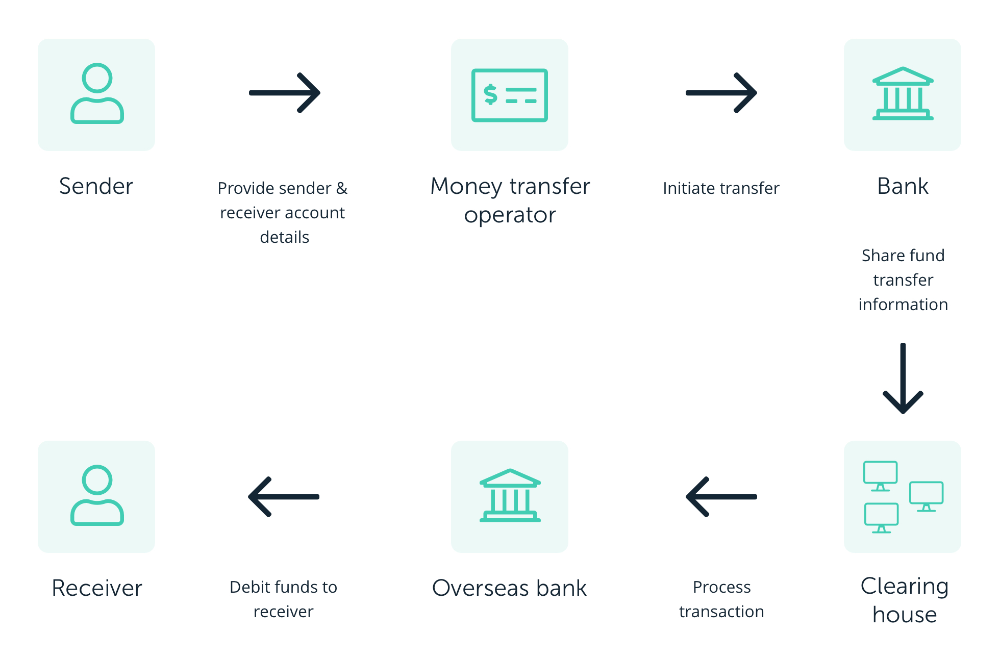
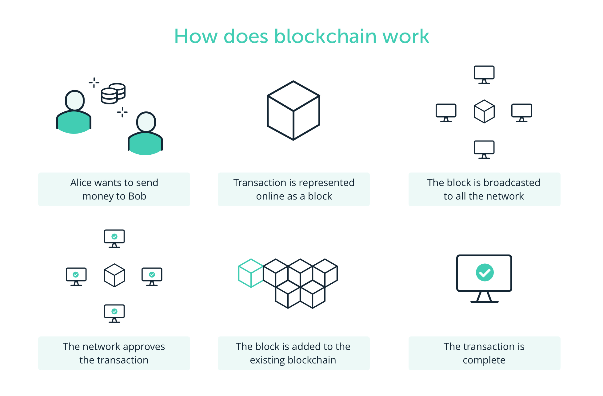

## Blockchain basics

* Unlike traditional methods, blockchain enables peer to peer transfer of digital assets without any intermediaries.
* It was a technology originally created to support the famous cryptocurrency, BitCoin.

### BitCoin: A Peer-to-Peer Electronic Cash System

* Two major contributions of cryptocurrency Bitcoin are a continuously working digital currency system, and a model 
for autonomous decentralized application technology called the blockchain.

* World wide web has enabled a technology explosion with Web 2.0 and the world of e-commerce applications. 
Around 2008, 2009, when the institutions and markets we trusted went crumbling down, and everybody was 
running away from the Wall Street, a mysterious person, or persons, called Satoshi Nakamoto, 
introduced a new digital currency, a cryptocurrency called Bitcoin.

* Bitcoin enabled an innovative platform for peer to peer transfer of value without any central authority.

#### With no central authority, how did Bitcoin realize trust and security?

By implementing software programs for **validation**, **verification**, **consensus** in a novel infrastructure called the blockchain.

* Later on in about 2012, 2013, computation elements were added to the blockchain infrastructure that has opened up a 
whole world of possibilities beyond simple currency transfer. 
These innovations are significantly shaping the direction of Web 3.0

#### What is a blockchain? 

* Blockchain is about enabling peer to peer transaction in a decentralized network. 

* Establishing trust among unknown peers. Recording the transaction in an immutable distributed ledger.

### Centralised vs Decentralized

Let's understand centralized versus decentralized network using a common scenario. 

Consider a scenario where customer wants to buy an item using her credit card. 
Let's enumerate the intermediaries involved in accomplishing this task. 
We have a credit card agency, we have a customer bank, we have a credit cards bank, we have an exchange, 
we have the merchant's bank, and finally, the merchant. This is an example of a centralized system that we are so used to.

Now compare this with a system where peers can transact directly with each other irrespective of where they are located. 
Functions of the intermediaries are shifted to the periphery to the peer participant in the blockchain infrastructure. 
Peers are not necessarily known to each other. This is a decentralized system. 

#### How do we establish trust among the peers in such a decentralized system? 
By having a process in place to validate, verify, and confirm transactions. 
Record the transaction in a distributed ledger of blocks, create a tamper-proof record of blocks, chain of blocks, and 
implement a consensus protocol for agreement on the block to be added to the chain. 
So, validation, verification, consensus, and immutable recording lead to the trust and security of the blockchain.

### How does blockchain transaction work?

Let's consider a common scenario.

* Say Alice is lending Bob $10,000. This is one single peer to peer transaction. Alice and Bob both make a note of it on a ledger.
* What if Alice changes the entry from $10,000 to $11,000? Alternatively, WHat if Bob changes her entry from $10,000 to $1,000? 
* To prevent this trust violation, we need to seek the help of people around us, Lisa, Allison, and Francis. Provide all of them a valid copy of this ledger.
* This is the basic concept of an immutable distributed ledger defined in a blockchain process.

In this scenario, we were all physically present in one location, Amherst. Now imagine this to be an online transaction to an unknown peer. Also, scale up the one transaction to 10,000 transactions, how about a million transactions.

I should be able to transact with equal ease to any unknown peer in Amherst, Albany, or Albania, maybe to send some flowers to a friend in Albania. This is the tenet of a decentralized system supported by blockchain.

In the case just described, how do we trust our unknown peers? Through verification and validation. In our example, Bob requests Kevin to verify the amount Alice transacted with her.

Kevin checks it, oops, Kevin finds the amount of the transaction is not 10,000, but 300, not valid. Kevin rejects and nullifies the transaction. Similar to these, validation, then verification methods devised by the blockchain and implemented by the peers provide the collector trust needed in a decentralized system. Summarizing, blockchain technology supports methods for a decentralized peer-to-peer system, a collective trust model, and a distributed immutable ledger of records of transactions.

### Key takeaways
A public blockchain is a distributed ledger, similar to a database, which has different key attributes:

- decentralized: there are no third party involved
- distributed: the ledger is spread across the whole network, which makes tempering difficult
- encrypted
- anonymous 
- once a data is added to the ledger, it cannot be removed or altered

REF: https://www.ledger.com/academy/blockchain/what-is-blockchain
