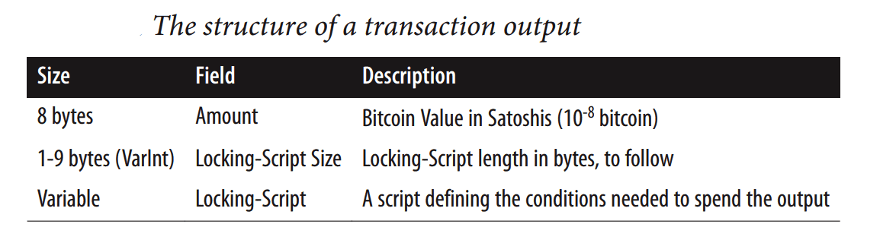
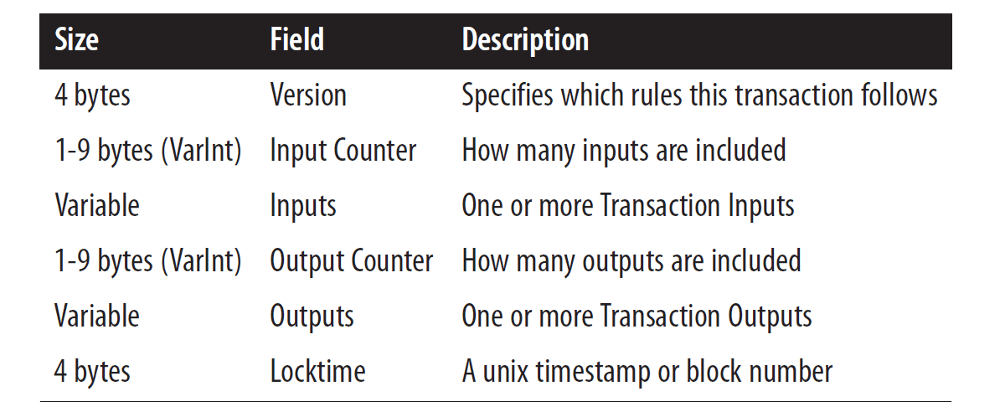

Here is the basic structure of a blockchain. 
* **Transaction** is the basic element of the Bitcoin Blockchain. Transactions are validated and broadcast. 
* Many transactions form a **block**. Many box form a chain through a digital data link. 
* Blocks go through a consensus process, to select the next block that will be added to the **chain**. Chosen block is verified, and added to the current chain.
* Validation and consensus process are carried out by special peer nodes called **miners**. These are powerful computers executing software defined by the blockchain protocol. 

```
There are no accounts or balances in bitcoin; 
there are only unspent transaction outputs (UTXO) scattered in the blockchain.
```

Let's now discuss the details of a single transaction in bitcoin. 
* A fundamental concept of a bitcoin network is an **Unspent Transaction Output**, also known as **UTXO**. 
* The set of all UTXOs in a bitcoin network collectively defined the state of the Bitcoin Blockchain.
* UTXOs are referenced as inputs in a transaction. UTXOs are also outputs generated by a transaction.
* All of that UTXOs is in a system, are stored by the participant nodes in a database.


Now let's review the role of the UTXO's in a Bitcoin Blockchain.
* The transaction uses the amount specified by one or more UTXOs and transmits it to one or more newly created output UTXOs, according to the request initiated by the sender. 

### UTXO Structure

Structure of UTXO:
*  It includes a unique identifier of the transaction that created this UTXO
*  an index or the position of the UTXO in the transaction output list
*  a value or the amount it is good for
*  And an optional script, the condition under which the output can be spent



A UTXO consists of a locking script & the amount that is to be transferred. The locking script locks the transaction amount. For someone to use the transaction amount, an unlocking script is required.

Think of UTXO as a safe-deposit box that locks some amount of bitcoin. Anyone that has the key to that safe can spend that bitcoin.

So to make a transaction, Bob asks Alice for her bitcoin address. He then creates a UTXO with an amount of 5 BTC and a locking script using Alice's bitcoin address such that only Alice can create an unlocking script using her private key.

```
Sending someone bitcoin is basically creating an unspent transaction output (UTXO) that is 
cryptographically locked and can only be accessed by the receiver's private key.
```

We can use the blockchain.info API(API URL is `https://blockchain.info/unspent?active=<address>`) to find the unspent outputs (UTXO) of a specific address(example address:  `1Dorian4RoXcnBv9hnQ4Y2C1an6NJ4UrjX`). 

It returns a JSON object with a list `unspent_outputs`, containing UTXO, like this:

```json
{
    "unspent_outputs": [
        {
            "tx_hash": "ebadfaa92f1fd29e2fe296eda702c48bd11ffd52313e986e99ddad9084062167",
            "tx_index": 51919767,
            "tx_output_n": 1,
            "script": "76a9148c7e252f8d64b0b6e313985915110fcfefcf4a2d88ac",
            "value": 8000000,
            "value_hex": "7a1200",
            "confirmations": 28691
        },
        ...
    ]
}
```

### Transaction

Structure of Transaction:
* The transaction itself includes a reference number of the current transaction
*  references to one no more input UTXOs
*  references to one or more output UTXOs newly generated by the current transaction
*  and the total input amount and output amount

A bitcoin transaction is just an entry in the blockchain that indicates transfer of bitcoins. Transaction of bitcoins is quite different from a banking transaction. In a banking system, you have an account where you store all your money. To make a transaction you'd transfer money from your account to the receiver's account. In Bitcoin, there's no such thing as an Account.

Recall, the blockchain is just a list of transactions. There is no such entry in the blockchain that states that Bob's account has 5 BTC or even that there's an account that belongs to Bob. To put it precisely, there's no concept of balance in Bitcoin.

So how and where does one store bitcoins? To answer that we need to understand transactions.

A transaction comprises of a bunch of metadata which are shown below.


Structure of a bitcoin transaction. Source: Mastering Bitcoin by Andreas Antonopolous

#### Bitcoin transaction

```json
  "txid" : "id",        (string) The transaction id (same as provided)
  "hash" : "id",        (string) The transaction hash (differs from txid 
                                 for witness transactions)
  "size" : n,           (numeric) The serialized transaction size
  "vsize" : n,          (numeric) The virtual transaction size (differs 
                                  from size for witness transactions)
  "version" : n,        (numeric) The version
  "locktime" : ttt,     (numeric) The lock time
  "vin" : [             (array of json objects)
     {
       "txid": "id",    (string) The transaction id
       "vout": n,       (numeric)
       "scriptSig": {   (json object) The script
         "asm": "asm",  (string) asm
         "hex": "hex"   (string) hex
       },
       "sequence": n    (numeric) The script sequence number
       "txinwitness": ["hex", ...] (array of string) hex-encoded witness 
                                  data (if any)
     }
     ,...
  ],
  "vout" : [            (array of json objects)
     {
       "value" : x.xxx,     (numeric) The value in BTC
       "n" : n,             (numeric) index
       "scriptPubKey" : {   (json object)
         "asm" : "asm",     (string) the asm
         "hex" : "hex",     (string) the hex
         "reqSigs" : n,     (numeric) The required sigs
         "type" : "pubkeyhash",  (string) The type, eg 'pubkeyhash'
         "addresses" : [    (json array of string)
           "address"        (string) bitcoin address
           ,...
         ]
       }
     }
     ,...
  ],
  "blockhash" : "hash",   (string) the block hash
  "confirmations" : n,    (numeric) The confirmations
  "time" : ttt,           (numeric) The transaction time in seconds since 
                                    (Jan 1 1970 GMT)
  "blocktime" : ttt       (numeric) The block time in seconds since (Jan 1 
                                    1970 GMT)
}
```

Participants can validate the transaction contents.

Does the UTXO's reference input exist in the network state? This is the only one of the many validation criteria. Say Alice gives Bob $10,000 in an envelope. This is similar to Alice asking Bob to verify the money in the envelope to be $10,000.

REF: https://www.adityathebe.com/what-does-it-mean-to-own-bitcoins

REF: https://mlsdev.com/blog/156-how-to-build-your-own-blockchain-architecture
