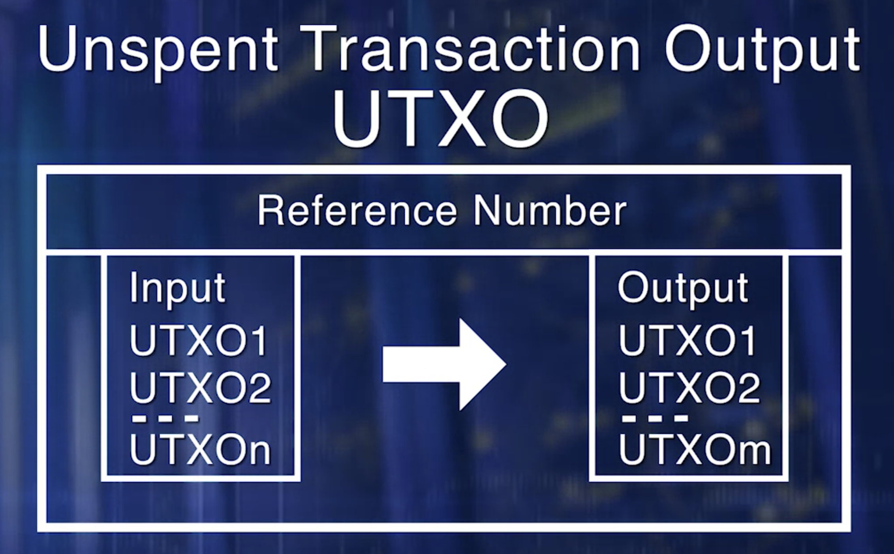

TODO: https://mlsdev.com/blog/156-how-to-build-your-own-blockchain-architecture and 
https://www.coursera.org/learn/blockchain-basics/lecture/5rj9Z/blockchain-structure

Here is the basic structure of a blockchain. 
* **Transaction** is the basic element of the Bitcoin Blockchain. Transactions are validated and broadcast. 
* Many transactions form a **block**. Many box form a chain through a digital data link. 
* Blocks go through a consensus process, to select the next block that will be added to the **chain**. Chosen block is verified, and added to the current chain.
* Validation and consensus process are carried out by special peer nodes called **miners**. These are powerful computers executing software defined by the blockchain protocol. 

```
There are no accounts or balances in bitcoin; 
there are only unspent transaction outputs (UTXO) scattered in the blockchain.
```

Let's now discuss the details of a single transaction in bitcoin. 
* A fundamental concept of a bitcoin network is an **Unspent Transaction Output**, also known as **UTXO**. 
* The set of all UTXOs in a bitcoin network collectively defined the state of the Bitcoin Blockchain.
* UTXOs are referenced as inputs in a transaction. UTXOs are also outputs generated by a transaction.
* All of that UTXOs is in a system, are stored by the participant nodes in a database.




Now let's review the role of the UTXO's in a Bitcoin Blockchain.
* The transaction uses the amount specified by one or more UTXOs and transmits it to one or more newly created output UTXOs, according to the request initiated by the sender. 


Structure of UTXO:
*  It includes a unique identifier of the transaction that created this UTXO
*  an index or the position of the UTXO in the transaction output list
*  a value or the amount it is good for
*  And an optional script, the condition under which the output can be spent


We can use the blockchain.info API(API URL is `https://blockchain.info/unspent?active=<address>`) to find the unspent outputs (UTXO) of a specific address(example address:  `1Dorian4RoXcnBv9hnQ4Y2C1an6NJ4UrjX`). 

It returns a JSON object with a list `unspent_outputs`, containing UTXO, like this:

```json
{
    "unspent_outputs": [
        {
            "tx_hash": "ebadfaa92f1fd29e2fe296eda702c48bd11ffd52313e986e99ddad9084062167",
            "tx_index": 51919767,
            "tx_output_n": 1,
            "script": "76a9148c7e252f8d64b0b6e313985915110fcfefcf4a2d88ac",
            "value": 8000000,
            "value_hex": "7a1200",
            "confirmations": 28691
        },
        ...
    ]
}
```

Transaction:
* The transaction itself includes a reference number of the current transaction
*  references to one no more input UTXOs
*  references to one or more output UTXOs newly generated by the current transaction
*  and the total input amount and output amount

Structure of a bitcoin transaction. Source: Mastering Bitcoin by Andreas Antonopolous


```
Sending someone bitcoin is basically creating an unspent transaction output (UTXO) that is 
cryptographically locked and can only be accessed by the receiver's private key.
```

Participants can validate the transaction contents.

Does the UTXO's reference input exist in the network state? This is the only one of the many validation criteria. Recall our demonstrated scenario. This is similar to Amy asking Kevin to verify the money in the envelope to be $10,000.
